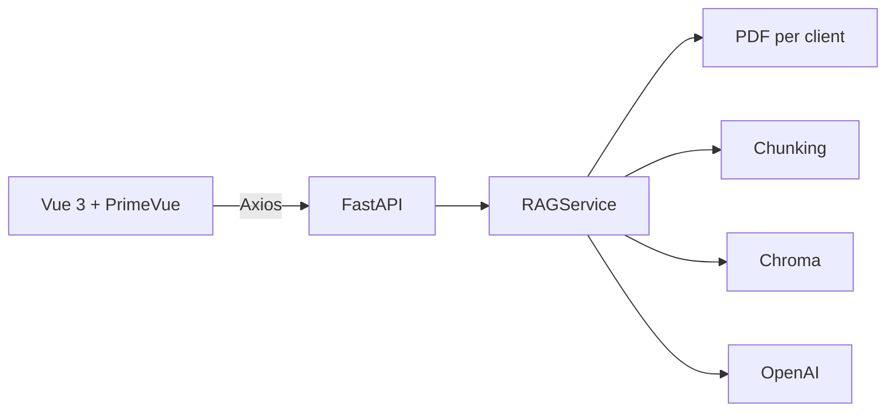

# Fullstack RAG COM

## About me / Sobre mí
**English:** I am Mishell Ramos, a full-stack engineer focused on data products, AI/ML, and robust architectures that favor SOLID, DRY, KISS, and security-by-default practices.

**Español:** Soy Mishell Ramos, ingeniera full-stack enfocada en productos de datos, IA/ML y arquitecturas robustas que aplican SOLID, DRY, KISS y seguridad por defecto.

## Repository goal / Objetivo del repositorio
**English:** Showcase a production-ready MVP that mixes FastAPI, LangChain, OpenAI, and Vue 3 to deliver a RAG workflow for COM operators.

**Español:** Mostrar un MVP listo para producción que combina FastAPI, LangChain, OpenAI y Vue 3 para ofrecer un flujo RAG para operadores de COM.

## Projects / Proyectos
- **fullstack_rag_com** (folder: `.`) — Stack: FastAPI, LangChain, OpenAI, Chroma, Vue 3, Tailwind, PrimeVue, Docker. A COM operator console to query customer procedures (ACME, CAME) with RAG, contextual chunks, and session history.

## Global tech stack / Stack tecnológico
- Python, FastAPI, LangChain, OpenAI, Chroma, Pydantic
- JavaScript, Vue 3, Vite, Tailwind CSS, PrimeVue 4, Axios
- Docker & docker-compose

## Studies / Estudios
**English:** B.Sc. in Systems Engineering; continuous training in cloud, AI/ML, and secure software design.

**Español:** Licenciada en Ingeniería de Sistemas; formación continua en nube, IA/ML y diseño seguro de software.

## Featured work / Proyectos destacados
- RAG pipelines with LangChain + OpenAI.
- Clean architecture services in FastAPI.
- Frontends with Vue + PrimeVue for data/ops tooling.

## Quality & practices / Calidad y buenas prácticas
- SOLID, DRY, KISS applied across services and UI.
- Security: environment variables for secrets, no hardcoded keys, sensible defaults.
- Documentation with Mermaid diagrams, bilingual sections.
- Tests and linters recommended (add Pytest, Ruff, Vitest/Cypress in next iterations).

## Architecture overview / Visión general

## Getting started / Inicio rápido
**English:**
1. Create a `.env` from `.env.example` and add your `OPENAI_API_KEY`.
2. Backend: `cd backend && pip install -r requirements.txt && uvicorn main:app --reload`.
3. Frontend: `cd frontend && npm install && npm run dev -- --host --port 5173`.

**Español:**
1. Crea `.env` a partir de `.env.example` y añade tu `OPENAI_API_KEY`.
2. Backend: `cd backend && pip install -r requirements.txt && uvicorn main:app --reload`.
3. Frontend: `cd frontend && npm install && npm run dev -- --host --port 5173`.

## Docker
**English:** `docker-compose up --build` launches backend (8000) and frontend (5173).

**Español:** `docker-compose up --build` levanta backend (8000) y frontend (5173).

## Security / Seguridad
- Secrets loaded from environment variables.
- CORS open for MVP; restrict origins in production.
- Local vector store persisted in volume to avoid data loss.

## Contact / Contacto
- **Email:** mishell.ramos@example.com
- **LinkedIn:** https://www.linkedin.com/in/mishell-ramos
